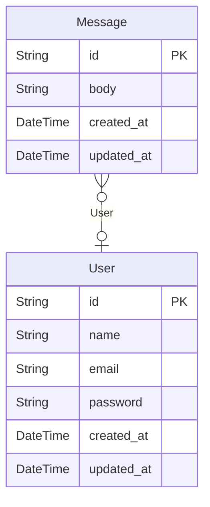

```mermaid
erDiagram

  User {
    String id PK 
    String name  
    String email  
    String password  
    DateTime created_at  
    DateTime updated_at  
    }
  

  Message {
    String id PK 
    String body  
    DateTime created_at  
    DateTime updated_at  
    }
  
    Message o{--|o User : "User"
```
