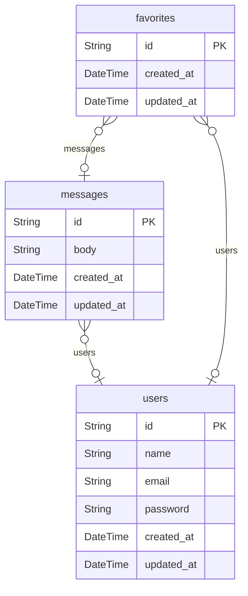

```mermaid
erDiagram

  users {
    String id PK 
    String name  
    String email  
    String password  
    DateTime created_at  
    DateTime updated_at  
    }
  

  messages {
    String id PK 
    String body  
    DateTime created_at  
    DateTime updated_at  
    }
  

  favorites {
    String id PK 
    DateTime created_at  
    DateTime updated_at  
    }
  
    messages o{--|o users : "users"
    favorites o{--|o users : "users"
    favorites o{--|o messages : "messages"
```
