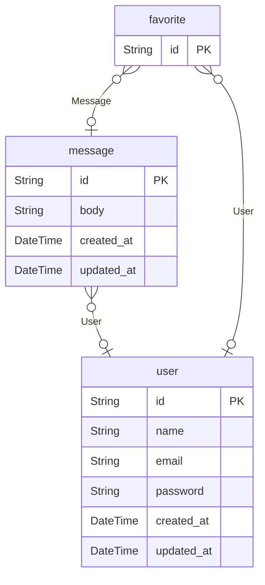

```mermaid
erDiagram

  user {
    String id PK 
    String name  
    String email  
    String password  
    DateTime created_at  
    DateTime updated_at  
    }
  

  message {
    String id PK 
    String body  
    DateTime created_at  
    DateTime updated_at  
    }
  

  favorite {
    String id PK 
    }
  
    message o{--|o user : "User"
    favorite o{--|o user : "User"
    favorite o{--|o message : "Message"
```
